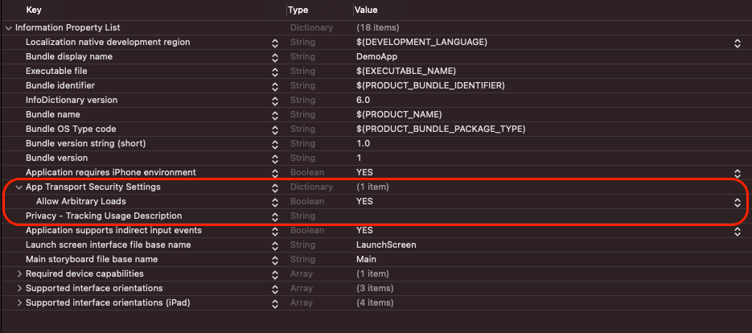
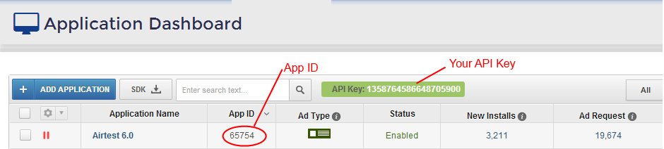

AirMonetizationSDK
======
> **iOS In-App SDK 11.4.6 Documentation**

## Overview
The Airnowmedia SDK is the most powerful app monetization solution in the industry, providing developers with stunning performance and weekly payouts. Airnowmedia developers consistently earn many times more revenue than with any other ad network because our advanced new ad units outperform everything else available in the industry. This document covers installation instructions, available ad units and their features, optimization and best practices. It is written for developers with the assumption they are familiar with iOS development.

## Ad Units
There are 4 types of ad units available in this SDK. To enable and optimize each of these ad units, select the corresponding check box next to each ad unit in 'Step 2' of adding your app.

#### In-App and Inline Banner Ads
In-App and Inline Banner Ads are a staple of the mobile advertising world. Combined with the rest of Airnowmedia’s industry leading ad types, In-App Banner Ads enable iOS developers to monetize their users at every point in their mobile experience and maximize their revenue.

#### Interstitial
Interstitial is a revolutionary new interstitial format that dramatically outperforms all other others on the market.

#### VAST Ads
VAST is a Video Ad Serving Template for structuring ad tags that serve ads to videoplayers. Using an XML schema, VAST transfers important metadata about an ad from the adserver to a video player. 

#### Rewarded VAST Ads

VAST is a Video Ad Serving Template for structuring ad tags that serve ads to videoplayers. Using an XML schema, VAST transfers important metadata about an ad from the adserver to a video player. Users can receive rewards for viewing this type of ads

## Installation Instructions
The Airnowmedia InApp iOS SDK contains the code necessary to install Airnowmedia in-app ads in your application.

##### Airnowmedia InApp iOS SDK Requirements:
1. iOS 11.0 or later
2. XCode 11.0 or later

##### Step 1 – Add the SDK to Your Project
Airnow SDK supports Cocoapods, Swift Package Manager and manual download mechanisms to integrate our SDK:

###### CocoaPods
CocoaPods is a dependency manager for Objective-C and Swift. It automates and simplifies the SDK integration process. 
To integrate our SDK with Cocoapods, enter the following line in your podfile:
`pod 'AirMonetizationSDK', :git => 'https://github.com/airnowplatform/airnow-ios-sdk.git'`

###### Swift Package Manager
1. Open Xcode project. Go to **File** -> **Swift Packages** -> **Add Package Dependency...**
2. Put out github link (**https://github.com/airnowplatform/airnow-ios-sdk.git**) there.
3. Install **AirMonetizationSDK**

###### Manually
1. Open your project folder.
2. Copy the AirMonetizationSDK.xcframework to your project folder.
3. Add the AirMonetizationSDK.xcframework to your project using **"Add Files to YOUR_PROJECT"**
4. Go to **“Frameworks, Libraries, and Embedded Content”** tab of your project target and set **"Embed & Sign"** for the AirMonetizationSDK.xcframework.

##### Step 2 – Configure your project to receive ads.
1. Add the following permissions to your project's `Info.plist` file.
 a) **App Transport Security Setting** -> **Allow Arbitrary Loads** -> **YES**
 b) For iOS 14.0 or later: **Privacy – Tracking Usage Description** -> ***YOUR DESCRIPTION OF WHY A USER SHOULD GRANT THE APPLICATION ACCESS TO THE IDFA***.

c) Add ad network support to your project's `Info.plist` file. Our ad network id - **v6d33e8t63.skadnetwork**. 
More information is about Ad Network here - [SKAdNetwork - Configuring a Source App](https://developer.apple.com/documentation/storekit/skadnetwork/configuring_a_source_app) 

> NOTE: This may affect the number of clicks on advertising banners.

2. Import our iOS SDK to the files where you want to use it.
```swift
import AirMonetizationSDK
```
3. Import **AppTrackingTransparency** framework for iOS 14.0 or later.
```swift
import AppTrackingTransparency
```
Finally, ask the user for permission to provide personalized ads. If you call **“ATTrackingManager.requestTrackingAuthorization(completionHandler:)”** method when you do not have permission on `Info.plist`  file, you will get an app crash.
```swift
ATTrackingManager.requestTrackingAuthorization { status in
                switch status {
                case ATTrackingManager.AuthorizationStatus.authorized:
                    print("ATTrackingManager.AuthorizationStatus.authorized")
                case ATTrackingManager.AuthorizationStatus.denied:
                    NSLog("ATTrackingManager.AuthorizationStatus.denied")
                case ATTrackingManager.AuthorizationStatus.restricted:
                    NSLog("ATTrackingManager.AuthorizationStatus.restricted")
                case ATTrackingManager.AuthorizationStatus.notDetermined:
                    NSLog("ATTrackingManager.AuthorizationStatus.notDetermined")
                @unknown default:
                    break
                }
            }
```
> NOTE: If you load some ads before you request user permissions, the user won’t receive personalized ads.

##### Step 3 – Code Integration.
AirMonetization SDK currently supports 5 types of advertising: `Inline` and `In-App banners`, `Interstitial Ads`, `VAST Video Ads`, `Rewarded VAST Video Ads`.

1.    Import **“AirMonetizationSDK”** in `AppDelegate.swift` file. Also add the following code in `didFinishLaunchingWithOptions` method. Also set the test mode for the SDK if necessary. In test mode, ads work as usual, but they are not tracked or monetized.
```swift
AirMonetization.shared.setAPIKey(key: "YOUR_API_KEY", appID: "YOUR_APP_ID")
AirMonetization.shared.setTestMode(testMode: true)
```

2.    Set the `APP ID` and `API KEY` in your project, which was given to you when registering your iOS application on [Airnowmedia](https://airnowmedia.com "Airnowmedia"). It's a numeric code that can be found by locating your app in the apps dashboard.

3. Perform the following steps in the **ViewController** in which you wish to display Ads.
a) Add an instance of **“AirMonetizationAd”** class to **ViewController**. For example:
```swift
var adView: AirMotetizationAd? = nil
```
b) Initialize adView instance with type of ad you want to use in your `ViewController` and implement its delegate methods. **We recommend using the “viewWillAppear” method for this.**
You can initiate one of the following types of ads: Inline banner, in-app banner, interstitial ads, vast video ads, rewarded ads. For example:

###### In-App Banner
```swift
adView = AirMonetizationInappBanner.inappBanner(withBannerSize: AirMonetizationBannerSize(width: 320, height: 50))
//Placement Name for banners is optional
adView?.setPlacementName(placementName: "YOUR_AD_PLACEMENT_NAME")
adView?.delegate = self
```
> **AirMonetizationInappBanner.inappBanner(withBannerSize:)** – Returns instantiated AirMonetizationInappBanner object ready to load.
**setPlacementName(placementName:)** - Set placement name for your ad. For placement name see your Dashboard.
**bannerSize** - The specific size of the banner. If you don't set your value, 320x50 size will be used.
**delegate** - Delegate that implements AirMonetizationAdDelegate protocol.

###### Inline banner
```swift
adView = AirMonetizationInlileBanner.inlineBanner(bannerView: inlineBannerView, withBannerSize: AirMonetizationBannerSize(width: 320, height: 50))
//Placement Name for banners is optional
adView?.setPlacementName(placementName: "YOUR_AD_PLACEMENT_NAME")
adView?.delegate = self
```
> **AirMonetizationInlileBanner.inlineBanner(bannerView:, withBannerSize:)** - instantiated AirMonetizationInlileBanner object ready to load.
**setPlacementName(placementName:)** - Set placement name for your ad. For placement name see your Dashboard.
**bannerView** - view you want to put the banner in.
**bannerSize** - The specific size of the banner. If you don't set your value, 320x50 size will be used.
**delegate** - Delegate that implements AirMonetizationAdDelegate protocol.

###### Interstitial Ads
```swift
adView = AirMonetizationInterstitial.interstitial()
//Placement Name for banners is optional
adView?.setPlacementName(placementName: "YOUR_AD_PLACEMENT_NAME")
adView?.delegate = self
```
> **AirMonetizationInterstitial.interstitial()** - instantiated AirMonetizationInterstitial object ready to load.
**setPlacementName(placementName:)** - Set placement name for your ad. For placement name see your Dashboard.
**delegate** - Delegate that implements AirMonetizationAdDelegate protocol.

###### VAST video Ads
```swift
adView = AirMonetizationVAST.vastVideo()
//Placement Name for banners is optional
adView?.setPlacementName(placementName: "YOUR_AD_PLACEMENT_NAME")
adView?.delegate = self
```
> **AirMonetizationVAST.vastVideo()** - instantiated AirMonetizationVAST object ready to load.
**setPlacementName(placementName:)** - Set placement name for your ad. For placement name see your Dashboard.
**delegate** - Delegate that implements AirMonetizationAdDelegate protocol.

###### Rewarded VAST video Ads
```swift
adView = AirMonetizationRewarded.rewarded(placementName: "YOUR_AD_PLACEMENT_NAME")
adView?.setUserId(userId: "UNIQUE_USER_ID")
adView?.rewardDelegate = self
```
> **AirMonetizationRewarded.rewarded(placementName:)** - instantiated AirMonetizationRewarded object ready to load.
**placementName** - Set placement name for your ad. For placement name see your Dashboard.
**setUserId(userId:)** - Set unique user id for each user. It is necessary to get you the correct statistics about the rewards for each user.
**rewardDelegate** - Delegate that implements AirMonetizationRewardedAdDelegate protocol.

c) To Receive delegate call back from **AirMonetizationSDK**, perform the following steps in `ViewController`
• Confirm the `AirMonetizationAdDelegate` or `AirMonetizationRewardedAdDelegate` protocol.
• Implement delegate methods in your `ViewController`.
```swift
extension YourViewController: AirMonetizationAdDelegate {
    func adDidStartLoad(ad: AirMotetizationAd) {
        print("AirMotetizationAdDelegate: \(#function)")
    }

    func adDidFinishLoad(ad: AirMotetizationAd) {
        print("AirMotetizationAdDelegate: \(#function)")
    }

    func adDidShow(ad: AirMotetizationAd) {
        print("AirMotetizationAdDelegate: \(#function)")
    }

    func adDidClick(ad: AirMotetizationAd) {
        print("AirMotetizationAdDelegate: \(#function)")
    }

    func adDidClose(ad: AirMotetizationAd) {
        print("AirMotetizationAdDelegate: \(#function)")
    }

    func adDidComplete(ad: AirMotetizationAd) {
        print("AirMotetizationAdDelegate: \(#function)")
    }

    func adDidDismiss(ad: AirMotetizationAd) {
        print("AirMotetizationAdDelegate: \(#function)")
    }

    func adDidFailWithError(ad: AirMotetizationAd, error: String) {
        print("AirMotetizationAdDelegate: \(#function)")
    }
    
    func adDidShowFailWithError(ad: AirMotetizationAd, error: String) {
        print("AirMotetizationAdDelegate: \(#function)")
    }
}
```

```swift
extension YourViewController: AirMonetizationRewardedAdDelegate {
    func rewardedAdDidStartLoad(ad: AirMotetizationAd) {
        print("AirMonetizationRewardedAdDelegate: \(#function)")
    }

    func rewardedAdDidFinishLoad(ad: AirMotetizationAd, rewardName: String, rewardValue: Int) {
        print("AirMonetizationRewardedAdDelegate: \(#function)")
    }
    
    func rewardedAdDidReceiveReward(ad: AirMotetizationAd, rewardName: String, rewardValue: Int) {
        print("AirMonetizationRewardedAdDelegate: \(#function)")
    }

    func rewardedAdDidShow(ad: AirMotetizationAd) {
        print("AirMonetizationRewardedAdDelegate: \(#function)")
    }

    func rewardedAdDidClick(ad: AirMotetizationAd) {
        print("AirMonetizationRewardedAdDelegate: \(#function)")
    }

    func rewardedAdDidClose(ad: AirMotetizationAd) {
        print("AirMonetizationRewardedAdDelegate: \(#function)")
    }

    func rewardedAdDidComplete(ad: AirMotetizationAd) {
        print("AirMonetizationRewardedAdDelegate: \(#function)")
    }

    func rewardedAdDidDismiss(ad: AirMotetizationAd) {
        print("AirMonetizationRewardedAdDelegate: \(#function)")
    }

    func rewardedAdDidFailWithError(ad: AirMotetizationAd, error: String) {
        print("AirMonetizationRewardedAdDelegate: \(#function)")
    }
    
    func rewardedAdDidShowFailWithError(ad: AirMotetizationAd, error: String) {
        print("AirMotetizationAdDelegate: \(#function)")
    }
}
```

d) To start loading ads, call the **“load”** method of your **AirMonetizationAd** instance. This method must be called each time when you want to load **Interstitial** ad and **vast/rewarded video ad**. This method must be called only once to load **inline banner** and **in-app banner**. The banners will be updated automatically.
```swift
adView?.load()
```
e) To show ad after ad is loaded, call the **“show”** method of your AirMonetizationAd instance. For banners, we recommend calling this method on **“adDidFinishLoad(ad:)”** delegate method. For Interstitial Ads, VAST Ads and Rewarded Ads, we recommend checking whether the ad is available (**adView?.isCanOpen**) and then calling the display anywhere in the app.
```swift
adView?.show()
```
f) To deinitialize AirMonetizationAd instance, call the following methods. We recommend calling these methods in `viewWillDisappear` method.
```swift
if adView != nil {
    adView?.removeFromViewController()
    adView?.stop()
    adView?.dismiss()
    adView = nil
    }
```
#### Description of AirMonetizationAd methods
• **“isCanOpen: Bool”** property
```swift
var isCanOpen: Bool
```
**Description:** Determines whether the ad is available for display.

• **“load”** method
```swift
func load()
```
**Description:** Starts loading an Ad. If ad is already loaded calling this method dismiss it a new ad will start load.

• **“show”** method
```swift
func show()
```
**Description:** Shows the loaded ad on screen. If called before ad is loaded it will return an error on its delegate. You have to call this method by yourself in `adDidFinishLoad` (AirMonetizationAdDelegate) method.

• **“dismiss”** method
```swift
func dismiss()
```
**Description:** Hides, dismisses the ad, deallocates resources. If ad is currently loading - it will be stopped dismissed.

• **“stop”** method
```swift
func stop()
```
**Description:** Stops the ad's loading. For `In-App` and `Inline Banner` also stops the refreshing.

• **“removeFromViewController”** method
```swift
func removeFromViewController()
```
**Description:** Removes the ad from parent view controller. Required to remove `Inline banner` from the parent view controller.

#### Description of AirMonetizationAdDelegate methods

• **“adDIdStartLoad(ad:)”** method
```swift
func adDidStartLoad(ad: AirMotetizationAd) {

}
```
**Description:** Invoked just after starting ad loading request to server.
`param ad` – Corresponding AirMotetizationAd object.

• **“adDidFinishLoad(ad:)”** method
```swift
func adDidFinishLoad(ad: AirMotetizationAd) {
    
}
```
**Description:** Invoked once ad is loaded and ready to show. You have to call `show` method on AirMotetizationAd by yourself. Otherwise, it won't be displayed. Use this method to pause any activity like game/video/music etc. and then show the ad.
`param ad` – Corresponding AirMotetizationAd object.

• **“adDidShow(ad:)”** method
```swift
func adDidShow(ad: AirMotetizationAd) {

}
```
**Description:** Invoked after ad is displayed on screen.
`param ad` – Corresponding AirMotetizationAd object.

• **“adDidClick(ad:)”** method
```swift
func adDidClick(ad: AirMotetizationAd) {

}
```
**Description:** Invoked just after user's click on ad but before its processing.
`param ad` – Corresponding AirMotetizationAd object.

• **“adDidClose(ad:)”** method
```swift
func adDidClose(ad: AirMotetizationAd) {

}
```
**Description:** Invoked after user closed an ad with a close button.
`param ad` – Corresponding AirMotetizationAd object.

• **“adDidComplete(ad:)”** method
```swift
func adDidComplete(ad: AirMotetizationAd) {

}
```
**Description:** Invoked after a user's click on ad is processed and user is redirected to advertiser's URL. Also invoked after user finishes ad action. Getting this delegate's event while redirection usually means that application is left and likely is going to background. Process it appropriately.
`param ad` – Corresponding AirMotetizationAd object.

• **“adDidDismiss(ad:)”** method
```swift
func adDidDismiss(ad: AirMotetizationAd) {

}
```
**Description:** Invoked when all ad actions are finished and ad deallocated its resources. After this method you can deallocate `AirMotetizationAd` object itself. Use this method to continue playing of your game/video/audio.
`param ad` – Corresponding AirMotetizationAd object.

• **“adDidFailWithError(ad:, error:)”** method
```swift
func adDidFailWithError(ad: AirMotetizationAd, error: String) {

}
```
**Description:** Invoked in case of any error occurred on ad loading.
`param ad` – Corresponding AirMotetizationAd object.
`param error` – String with error description (contained “moreInformation” property).

• **“adDidShowFailWithError(ad:, error:)”** method
```swift
func adDidShowFailWithError(ad: AirMotetizationAd, error: String) {

}
```
**Description:** Invoked in case of any error occurred on ad displaying.
`param ad` – Corresponding AirMotetizationAd object.
`param error` – String with error description (contained “moreInformation” property).

#### Description of AirMonetizationRewardedAdDelegate methods

• **“rewardedAdDIdStartLoad(ad:)”** method
```swift
func rewardedAdDIdStartLoad(ad: AirMotetizationAd) {

}
```
**Description:** Invoked just after starting ad loading request to server.
`param ad` – Corresponding AirMotetizationAd object.

• **“rewardedAdDidFinishLoad(ad: , rewardName: , rewardValue:)”** method
```swift
func rewardedAdDidFinishLoad(ad: AirMotetizationAd, rewardName: String, rewardValue: Int) {
    
}
```
**Description:** Invoked once ad is loaded and ready to show. You have to call `show` method on AirMotetizationAd by yourself. Otherwise, it won't be displayed. Use this method to pause any activity like game/video/music etc. and then show the ad.
`param ad` – Corresponding AirMotetizationAd object.
`param rewardName` – Corresponding to the name of reward that the user received after viewing the ad.
`param rewardValue` – Corresponding to the count of the reward that the user received after viewing the ad.

• **“rewardedAdDidReceiveReward(ad: , rewardName: , rewardValue:)”** method
```swift
func rewardedAdDidReceiveReward(ad: AirMotetizationAd, rewardName: String, rewardValue: Int) {
    
}
```
**Description:** Invoked after reward is received for user.
`param ad` – Corresponding AirMotetizationAd object.
`param rewardName` – Corresponding to the name of reward that was received for user.
`param rewardValue` – Corresponding to the count of the reward that was received for user.

• **“rewardedAdDidShow(ad:)”** method
```swift
func rewardedAdDidShow(ad: AirMotetizationAd) {

}
```
**Description:** Invoked after ad is displayed on screen.
`param ad` – Corresponding AirMotetizationAd object.

• **“rewardedAdDidClick(ad:)”** method
```swift
func rewardedAdDidClick(ad: AirMotetizationAd) {

}
```
**Description:** Invoked just after user's click on ad but before its processing.
`param ad` – Corresponding AirMotetizationAd object.

• **“rewardedAdDidClose(ad:)”** method
```swift
func rewardedAdDidClose(ad: AirMotetizationAd) {

}
```
**Description:** Invoked after user closed an ad with a close button.
`param ad` – Corresponding AirMotetizationAd object.

• **“rewardedAdDidComplete(ad:)”** method
```swift
func rewardedAdDidComplete(ad: AirMotetizationAd) {

}
```
**Description:** Invoked after a user's click on ad is processed and user is redirected to advertiser's URL. Also invoked after user finishes ad action. Getting this delegate's event while redirection usually means that application is left and likely is going to background. Process it appropriately.
`param ad` – Corresponding AirMotetizationAd object.

• **“rewardedAdDidDismiss(ad:)”** method
```swift
func rewardedAdDidDismiss(ad: AirMotetizationAd) {

}
```
**Description:** Invoked when all ad actions are finished and ad deallocated its resources. After this method you can deallocate `AirMotetizationAd` object itself. Use this method to continue playing of your game/video/audio.
`param ad` – Corresponding AirMotetizationAd object.

• **“rewardedAdDidFailWithError(ad:, error:)”** method
```swift
func rewardedAdDidFailWithError(ad: AirMotetizationAd, error: String) {

}
```
**Description:** Invoked in case of any error occurred on ad loading.
`param ad` – Corresponding AirMotetizationAd object.
`param error` – String with error description.

• **“rewardedAdDidShowFailWithError(ad:, error:)”** method
```swift
func rewardedAdDidShowFailWithError(ad: AirMotetizationAd, error: String) {

}
```
**Description:** Invoked in case of any error occurred on ad displaying.
`param ad` – Corresponding AirMotetizationAd object.
`param error` – String with error description.

#### AdMob Mediation
##### Step 1 – Implement AdMob Ads in your app.
First you need to sign in to your [AdMob account](https://apps.admob.com "AdMob account"). In your app you can click on Ad Units and then **ADD AD UNITS** and select **Banner\Interstitial\Rewarded Ads**. 

In the configuration of the Ad Unit popup, you can specify a name for your ad placement and if you use rewarded placement - a name for the reward and a value. If you want to apply the same reward to the user no matter which ad network is served, check the **Apply to all networks in Mediation Groups** box.

##### Step 2 – Configure Mediation Settings for your AdMob Ad unit.
You need to add AirMonetization to the mediation configuration for your Ad unit.

Log in to your AdMob account. On the left side menu, click on the **Mediation** and then in Mediation Groups Tab. If you already have an existing **Mediation Group** you will need to modify it (click on the name of the Mediation Group and press **Edit**).

if you do not have a Mediation Group yet, click to create one with **CREATE MEDIATION GROUP**.

In the Ad Format drop down menu select **Banner\Interstitial\Rewarded** and for platform **iOS** and then you can name the Mediation Group if you do not have one already. Next, set the mediation group status to **Enabled**

Afterwards you should click **ADD AD UNITS** and associate the Mediation group with an existing AdMob Rewarded Ad unit.

You then have to add Airnow Network to the Mediationn Waterfall of the group. Click on **ADD CUSTOM EVENT**.

You can add a name to differentiate Airnow Network from your other ad sources (for example Airnow Network) and an estimated eCPM.

You can then configure Airnow ad unit by adding the class name of AirMonetization AdMob Mediation Adapter

**Banner Adapter**
**Class Name**: GADAdapterAirMonetizationBanner
**Parameter**: JSON with AirMonetization SDK configuration params

**Interstitial Adapter**
**Class Name**: GADAdapterAirMonetizationInterstitial
**Parameter**: JSON with AirMonetization SDK configuration params

**Rewarded Adapter**
**Class Name**: GADAdapterAirMonetizationRewarded
**Parameter**: JSON with AirMonetization SDK configuration params

**Note**: If your class is implemented in Swift, you need to prefix the class name with the name of its app / framework module (for example, **appName.className**).
Target name is required if you have multiple targets in your project or if the project name is different from the target name. With the target name, it would look like this: **appName_targetName.className**. In addition, remember to replace any non-alphanumeric characters such as dashes with underscores. For more details, [see this example](https://medium.com/@maximbilan/ios-objective-c-project-nsclassfromstring-method-for-swift-classes-dbadb721723 "see this example").

After that, you need pass a **JSON string** to provide the necessary params for AirMonetizationSDK SDK to work.
|                                Key                                |  Type  |
|:-----------------------------------------------------------------:|:------:|
| api_key (Sets AirMonetization SDK API key as provided by Airnow)  | String |
| test_mode (Sets AirMonetization SDK to Developer or Release mode) | Bool   |
| app_id (Sets AirMonetization SDK App id as provided by Airnow)    | String |
| placement_name (Sets ad placement name from Dashboard)    | String |

**For example:**
**{"api_key":"AIRNOW API KEY", "test_mode":true, "app_id":"AIRNOW APP ID", "placement_name":"YOUR AD PLACEMENT NAME"}**
> NOTE: placement_name is mandatory only for Rewarded Ads and optional for another types of Ads.

##### Step 3 – Set Up AirMonetization SDK.
Installing and configuring the AirMonetization SDK is described above.

##### Step 4 – Add AirMonetization AdMob Adapter to your project.
Download AirMonetization iOS AdMob Adapter files and then add them to your Xcode project.

>Notes: You need to add a **custom extras** including a unique user id to your request for Rewarded. For example: 
```swift
let adRequest = GADRequest()
let customAirnowExtras = GADAdapterAirMonetizationRewardedCustomExtras()
customAirnowExtras.setRewardedUserId(userID: "UNIQUE_USER_ID")
adRequest.register(customAirnowExtras)
```
#### MoPub Mediation
##### Step 1 – Add MoPub Ads in your app.

If you have not implemented [Banner Ads](https://developers.mopub.com/publishers/ios/banner "Banner Ads") \ [Interstitial Ads](https://developers.mopub.com/publishers/ios/interstitial "Interstitial Ads") \ [Rewarded Ads](https://developers.mopub.com/publishers/ios/rewarded-ad/ "Rewarded Ads") in your app yet, you can follow the documentation implementation as described by MoPub.

First you need to sign in to your [MoPub account](https://www.mopub.com "MoPub account"). In your app's section you can click to create a **New Ad Unit** and select **Banner** \ **Interstitial** \ **Rewarded Video**.

Fill in configuration of the Ad Unit. If you use **Rewarded Video Ad**: In the configuration of the Ad Unit you can specify a name for your rewarded placement. If you want you can specify the reward name and a fix amount by clicking **Add Reward**.

##### Step 2 – Configure Ad Sources for your Rewarded Ad unit.
You need to add Airnow Network as a **Custom Native Network** line item and link it with your Banner \ Interstitial \ Rewarded Ad unit.
Log in to your MoPub account. On the top, click on the **Orders** tab and then select **Create Order**. If you already have an existing **Order** item you will need to modify it by clicking on it.
In the Create Order form, fill the required fields and press **Save & Create line item**

Next you will be prompted to create a **New Line Item**. Please make sure the correct order item is selected. Then set **Airnow Network** as the line item name and **Network line item** as the Line item type.

On the **Network** field select **Custom SDK Network**. Set some of **AirMonetization Adapters (MPAirMonetizationMopubBannerAdapter \ MPAirMonetizationMoPubInterstitialAdapter \ MPAirMonetizationMoPubRewardedAdapter)** in the **Custom event class** field and optionally provide a JSON formatted text with your AirMonetization confiiguration (alternatively you can pass those params in code as described in Step 6) in the **Custom event data** field.

**Banner Adapter**
**Custom event class**: MPAirMonetizationMopubBannerAdapter
**Custom event data**: JSON with AirMonetization SDK configuration params

**Interstitial Adapter**
**Custom event class**: MPAirMonetizationMoPubInterstitialAdapter
**Custom event data**: JSON with AirMonetization SDK configuration params

**Rewarded Adapter**
**Custom event class**: MPAirMonetizationMoPubRewardedAdapter
**Custom event data**: JSON with AirMonetization SDK configuration params

After that, you need pass a **JSON string** to provide the necessary params for AirMonetizationSDK SDK to work.
|                                Key                                |  Type  |
|:-----------------------------------------------------------------:|:------:|
| api_key (Sets AirMonetization SDK API key as provided by Airnow)  | String |
| test_mode (Sets AirMonetization SDK to Developer or Release mode) | Bool   |
| app_id (Sets AirMonetization SDK App id as provided by Airnow)    | String |
| placement_name (Sets ad placement name from Dashboard)    | String |

**For example:**
**{"api_key":"AIRNOW API KEY", "test_mode":true, "app_id":"AIRNOW APP ID", "placement_name":"YOUR AD PLACEMENT NAME"}**
> NOTE: placement_name is mandatory only for Rewarded Ads and optional for another types of Ads.

Next head to the **Budget & Schedule** section and fill the Rate field with a value

Click next to proceed on the next step where you will select the Ad Unit on which this line item will apply. **Please select iOS only Ad Units**.

Click next to proceed on the next step where you will select the audience targeting of this Netwrok line item. Fill those fields as you wish or proceed with the default values.

##### Step 3 – Set Up AirMonetization SDK.
Installing and configuring the AirMonetization SDK is described above.

##### Step 4 – Add AirMonetization MoPub Adapter to your project.
Download AirMonetization iOS MoPub Adapter files and then add them to your Xcode project.

##### Step 5 – Request for a RewardedAd.
Initialize **MoPub SDK** and pass **MPAirMonetizationAdapterConfiguration**, **MPAirMonetizationMopubBannerAdapter**, **MPAirMonetizationMoPubInterstitialAdapter**, **MPAirMonetizationMoPubRewardedAdapter** during the initialisation configuration.
```swift
let airMonetizationBannersConfiguration: [String: Any] = [
    "api_key": "AIRMONETIZATION_API_KEY",
    "app_id": "AIRMONETIZATION_APP_ID",
    "test_mode": true
]
let airMonetizationInterstitialConfiguration: [String: Any] = [
    "api_key": "AIRMONETIZATION_API_KEY",
    "app_id": "AIRMONETIZATION_APP_ID",
    "test_mode": true
]
let airMonetizationRewardedConfiguration: [String: Any] = [
    "api_key": "AIRMONETIZATION_API_KEY",
    "app_id": "AIRMONETIZATION_APP_ID",
    "test_mode": true,
    "placement_name": "AIRMONETIZATION_PLACEMENT_NAME",
    "user_id": "UNIQUE_ISER_ID"
]

let config = MPMoPubConfiguration(adUnitIdForAppInitialization: MoPubAdUnits.kMoPubInterstitialAdUnitID)
config.setNetwork(airMonetizationBannersConfiguration,
                  forMediationAdapter: "MPAirMonetizationAdapterConfiguration")
config.setNetwork(airMonetizationBannersConfiguration,
                  forMediationAdapter: "MPAirMonetizationMopubBannerAdapter")
config.setNetwork(airMonetizationInterstitialConfiguration,
                  forMediationAdapter: "MPAirMonetizationMoPubInterstitialAdapter")
config.setNetwork(airMonetizationRewardedConfiguration,
                  forMediationAdapter: "MPAirMonetizationMoPubRewardedAdapter")
config.additionalNetworks = [MPAirMonetizationAdapterConfiguration.self,
                             MPAirMonetizationMopubBannerAdapter.self,
                             MPAirMonetizationMoPubInterstitialAdapter.self,
                             MPAirMonetizationMoPubRewardedAdapter.self]
config.loggingLevel = .debug
MoPub.sharedInstance().initializeSdk(with: config)
```
Request a BannerAd \ InterstitialAd \ RewardedAd from MoPub using the Airnow configuration params that you provided on MoPub's Web UI (step 2). If no configuration is provided or if you want to override any of those params provided in the Web UI please see step 6.

```swift
let banner = MPAdView(adUnitId: "unitId")
banner?.frame = CGRect(x: 0, y: 0, width: 320, height: 50)
banner?.delegate = self
banner?.loadAd(withMaxAdSize: kMPPresetMaxAdSizeMatchFrame)
```
```swift
let interstitial = MPInterstitialAdController(forAdUnitId: "unitId")
interstitial?.delegate = self
interstitial?.loadAd()
```
```swift
MPRewardedAds.setDelegate(self, forAdUnitId: "unitId")
MPRewardedAds.loadRewardedAd(withAdUnitID: "unitId", withMediationSettings: nil)
```
Comform to **MPAdViewDelegate** \ **MPInterstitialAdControllerDelegate** \ **MPRewardedAdsDelegate** to get notified when the rewarded ad is ready to be shown

```swift
extension ViewController: MPAdViewDelegate {
    func viewControllerForPresentingModalView() -> UIViewController! { return self }
    func adViewDidLoadAd(_ view: MPAdView!, adSize: CGSize) {}
    func adView(_ view: MPAdView!, didFailToLoadAdWithError error: Error!) {}
    func willPresentModalView(forAd view: MPAdView!) {}
    func didDismissModalView(forAd view: MPAdView!){}
}
```

```swift
extension ViewController: MPInterstitialAdControllerDelegate {
    func interstitialDidLoadAd(_ interstitial: MPInterstitialAdController!) {}
    func interstitialDidFail(toLoadAd interstitial: MPInterstitialAdController!, withError error: Error!) {}
    func interstitialWillPresent(_ interstitial: MPInterstitialAdController!) {}
    func interstitialDidPresent(_ interstitial: MPInterstitialAdController!) {}
    func interstitialWillDismiss(_ interstitial: MPInterstitialAdController!) {}
    func interstitialDidDismiss(_ interstitial: MPInterstitialAdController!) {}
}
```

```swift
extension ViewController: MPRewardedAdsDelegate {
    func rewardedAdDidLoad(forAdUnitID adUnitID: String!) {}
    func rewardedAdDidFailToLoad(forAdUnitID adUnitID: String!, error: Error!) {}
    func rewardedAdDidPresent(forAdUnitID adUnitID: String!) {}
    func rewardedAdDidDismiss(forAdUnitID adUnitID: String!) {}
    func rewardedAdShouldReward(forAdUnitID adUnitID: String!, reward: MPReward!) {}
}
```

##### Step 6 – Create AirMonetization Params configuration Dictionary.
AirMonetization MoPub Adapter provides different options that you can use to control the behaviour of AirMonetization SDK overriding those set on the Web UI.
Below you can see all the key-value available options of that you can use to configure the behaviour of AirMonetization SDK.
|                                Key                                |  Type  |
|:-----------------------------------------------------------------:|:------:|
| api_key (Sets AirMonetization SDK API key as provided by Airnow)  | String |
| test_mode (Sets AirMonetization SDK to Developer or Release mode) | Bool   |
| app_id (Sets AirMonetization SDK App id as provided by Airnow)    | String |
| placement_name (Sets ad placement name from Dashboard)    | String |

**For example:**
**{"api_key":"AIRNOW API KEY", "test_mode":true, "app_id":"AIRNOW APP ID", "placement_name":"YOUR AD PLACEMENT NAME"}**
> NOTE: placement_name is mandatory only for Rewarded Ads and optional for another types of Ads.

```swift
let bannerAd = MPAdView(adUnitAd: "UNIT_AD")
let localExtras: [String: Any] = [
    "api_key": "AIRMONETIZATION_API_KEY",
    "app_id": "AIRMONETIZATION_APP_ID",
    "test_mode": true,
    "placement_name" "YOUR_AD_PLACEMENT_NAME"
]

bannerAd?.delegate = self
bannerAd?.localExtras = localExtras
bannerAd?.loadAd()
```
```swift
let interstitial = MPInterstitialAdController(forAdUnitAd: "UNIT_AD")
let localExtras: [String: Any] = [
    "api_key": "AIRMONETIZATION_API_KEY",
    "app_id": "AIRMONETIZATION_APP_ID",
    "test_mode": true,
    "placement_name" "YOUR_AD_PLACEMENT_NAME"
]

interstitial?.delegate = self
interstitial?.localExtras = localExtras
interstitial?.loadAd()
```
```swift
let localExtras: [String: Any] = [
    "api_key": "AIRMONETIZATION_API_KEY",
    "app_id": "AIRMONETIZATION_APP_ID",
    "test_mode": true,
    "placement_name" "YOUR_AD_PLACEMENT_NAME",
    "user_id": "UNIQUE_USER_ID"
]

MPRewardedAds.loadRewardedAd(withAdUnitID: "UNIT_AD", keywords: nil, userDataKeywords: nil, customerId: nil, mediationSettings: nil, localExtras: localExtras)
```
##### Step 7 – Publish your app on the store.
If you everything worked fine during the previous steps, you should turn AirMonetization to release mode and publish your app.

#### AirMonetization SDK Test Mode
You can set Test Mode to configure ads in your app. In test mode Ads are working as usual but aren't tracked and monetised.

• **“setTestMode(testMode:)”** method
```swift
AirMonetization.shared.setTestMode(testMode: true)
```
**Description:** Sets test mode for the SDK. In test mode Ads are working as usual but aren't tracked and monetised.
`param testMode` - Boolean value that must be set to enable or disable Test Mode.

• **“isTestMode”** value
```swift
let isTestMode: Bool = AirMonetization.shared.isTestMode
```
**Description:** Returns current test mode state
`return BOOL true` if test mode is enabled.
`return BOOL false` if test mode is disabled.

#### AirMonetization GDPR – Managing Consent
AirMonetization platform supports publisher communication of a user’s consent choice to mediated networks (for supported networks).

To use AirMonetization API to update a user’s consent status, use this functions:

If the user provided consent, please set the following flag to true:
```swift
AirMonetization.shared.setConsent(consent: .accept)
```

If the user did not consent, please set the following flag to false:
```swift
AirMonetization.shared.setConsent(consent: .noConsent)
```

If the user rejected consent, please set the following flag to false:
```swift
AirMonetization.shared.setConsent(consent: .reject)
```

If you need to get current consent state, use:
```swift
let currentConsentState: AirMonetizationGDPRStatus = AirMonetization.shared.getConsent
```

#### AirMonetization CCPA Compliance
AirMonetization platform (SDK Version 11.4.5+) supports publishers to restrict the sale of end users personal information under the California Consumer Privacy Act (CCPA).

The notification about personal information of specific users located in California should be handled based on a “UserDontSell” setting, by setting its value to “true” or “false”.

The API should be set before any advertisement will be triggered.

If the user has opted out of “sale” of personal information:
```swift
AirMonetization.shared.setUserDontSell(userDontSell: true)
```

If “sale” of personal information is permitted:
```swift
AirMonetization.shared.setUserDontSell(userDontSell: false)
```

#### AirMonetization User-Level Settings for Child-Directed Apps with Age Gates
AirMonetization platform (SDK Version 11.4.5+) enables publishers of child-directed apps to flag specific end-users as children, as may be permitted or required by applicable law (e.g. COPPA, GDPR, etc.). Publishers of child-directed apps are responsible for determining whether an app is permitted to flag at the end-user level or must treat all end-users as children. Publishers should consult with their legal counsel accordingly.

The indication of whether a specific end-user is a child should be done using a “isChildDirected” flag, by setting its value to “true” or “false”.

The API should be set before any advertisement will be triggered.

If the end-user is a child (as defined by applicable regulations):
```swift
AirMonetization.shared.setChildDirected(isChildDirected: true)
```

If the end-user is not a child:
```swift
AirMonetization.shared.setChildDirected(isChildDirected: false)
```

#### Advertising Identifier Usage
AirmonetizationSDK uses Advertising Identifier to server advertisements with in app, kindly select it accordingly while publishing your app to App Store.


#### Important Instructions
• For the best experience, please use the latest iOS SDK.
• If you are upgrading/updating the SDK, please don't forget to **clean & build** the project after completing all steps successfully.

#### Sample Application Code and Support
You can download the demo project "iOS SDK Integration DemoApp" using the following link https://github.com/airnowplatform/airnow-ios-sdk-demo-app. This is code demonstration on 'How to integrate AirMonetization iOS SDK' in your app.
Demo app will work without any modifications on simulator. If you need to run it on your device, attach your provisioning profile in the app and run it.
> Note: For the privacy of your users, Airnowmedia never stores personally identifiable information.
